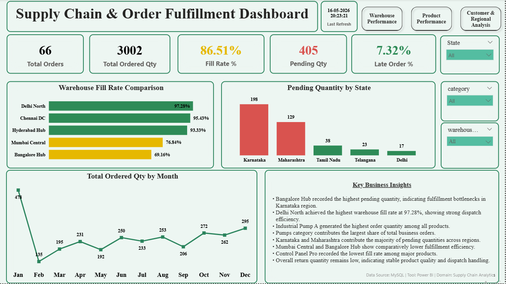
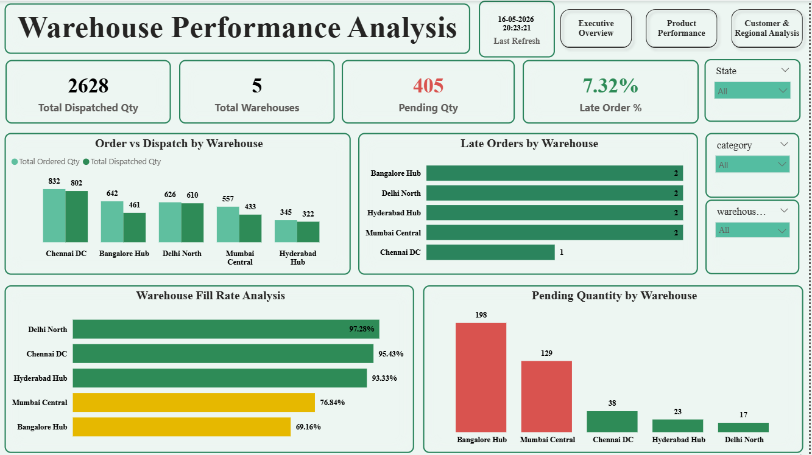
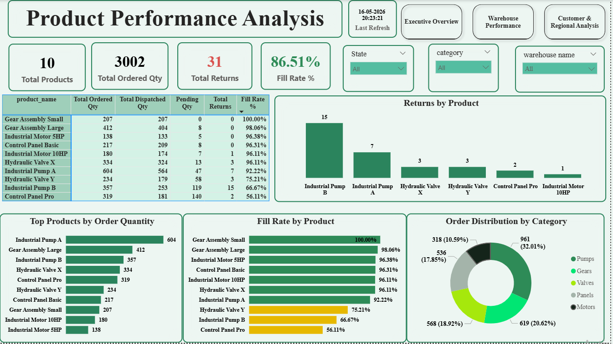
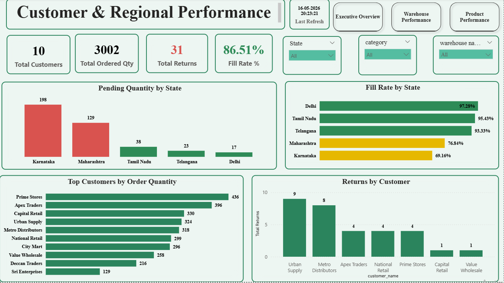

# Supply-Chain-Order-Fulfillment-Dashboard
End-to-end Supply Chain &amp; Order Fulfillment Analytics Dashboard using MySQL and Power BI

## Project Overview
This project analyzes supply chain and order fulfillment performance using MySQL and Power BI.  
The dashboard helps track warehouse efficiency, product performance, customer trends, pending quantities, fill rates, returns, and regional fulfillment performance.

---

## Business Problem
Businesses often face challenges in:
- Delayed dispatches
- High pending quantities
- Low fulfillment efficiency
- Product return tracking
- Regional supply chain bottlenecks

This dashboard provides actionable insights to monitor operational performance and improve decision-making.

---

## Tools & Technologies Used
- MySQL
- Power BI
- DAX
- Power Query
- Data Modeling

---

## Key KPIs
- Total Orders
- Ordered Quantity
- Dispatched Quantity
- Pending Quantity
- Fill Rate %
- Return Quantity
- Late Order %

---

## Dashboard Pages

### 1. Executive Overview
- Overall KPI tracking
- Monthly order trends
- Warehouse performance summary
- Key business insights

### 2. Warehouse Analysis
- Warehouse-wise fill rate analysis
- Pending quantity analysis
- Dispatch performance tracking
- Returns by warehouse

### 3. Product Analysis
- Product category performance
- Product-wise fill rate
- Product return analysis
- Order quantity distribution

### 4. Customer & Regional Analysis
- State-wise pending quantity
- Regional fill rate comparison
- Top customer analysis
- Customer order trends

---

## Key Insights
- Bangalore Hub recorded the highest pending quantity.
- Delhi North achieved the highest warehouse fill rate performance.
- Pumps category contributed the largest share of orders.
- Industrial Pump A generated the highest overall order quantity.
- Karnataka and Maharashtra showed higher pending quantities compared to other regions.

---

## Files Included
- Power BI Dashboard (.pbix)
- SQL Query File
- Dashboard Screenshots
- Dataset CSV

---

## Dashboard Screenshots

### Executive Overview

### Warehouse Analysis

### Product Analysis

### Customer & Regional Analysis

---

## Author
Divya Ravi
